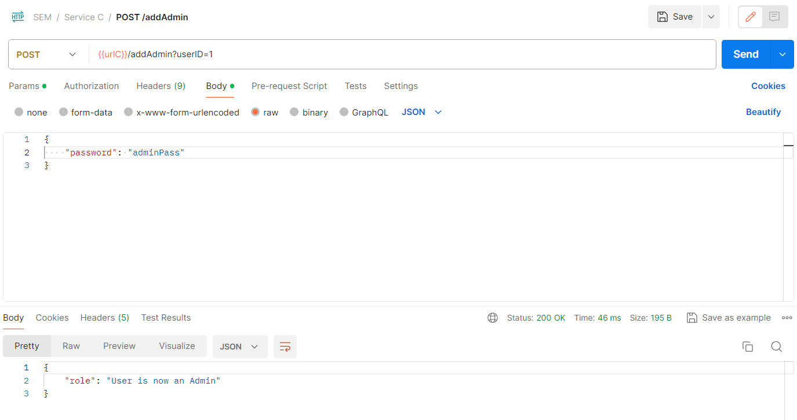

## Manual system tests ##
This document provides details about manual testing endpoints for adding a book to a bookshelf, and removing a book from a bookshelf.

## Set-up ##

### Microservice set-up ###
There are three things that need to be done in order to  run these manual tests:

1. Clone the `Bookshelf microservice` repository into its dedicated directory
2. In the `Bookshelf microservice`, go to `application.properties` and change `spring.profiles.active` to `prod`. In the end, it should look like this:
   ```properties
    server.port=8081
    spring.h2.console.enabled=true
    # Secret for the JWT signing
    # jwt.secret=exampleSecret
    
    server.error.include-message=always
    spring.profiles.active=prod
    ```
3. Run both microservices (ours and Bookshelf)

### Test set-up ###
Because the Bookshelf microservice has its own checks for existing users, books and _bookshelves_, please do the following (in order):

1. Register a user, if not created already: `NOTE: userId = 1` here
   ```http request
    POST http://localhost:8080/api/register/
    ```
   ```json
    {
        "email": "bookshelf-test-user@email.com",
        "password": "password",
        "username": "BookshelfUser"
    }
    ```
   
   
2. Add the user as an admin via the password using the endpoint for adding an admin.
   ```http request
   POST http://localhost:8080/api/addAdmin?userID=1 
   ```

   ```json
    {
        "password": "adminPass"
    } 
   ```
   
3. Create a book as `userId = 1`
   ```http request
    POST http://localhost:8080/api/collection?userID=1
   ```
   ```json
    {
        "title": "BookTitle",
        "author": "Author1,Author2",
        "genre": "COMEDY",
        "series": "NewSeriesName",
        "numberOfPages": 123
    }
   ```
   
4. Create a new shelf on the `BookshelfMicroservice`:
   ```http request
    POST http://localhost:8081/bookshelf?userId=1
    ```
   ```json
    {
        "name": "shelfName"
    }
    ```
   

### Test: Add book to bookshelf ###
You can test by sending the following request to our microservice:
```http request
POST http://localhost:8080/api/shelf?userID=1&shelfID=1&bookID=3
```
_(no body)_


### Test: Remove book from bookshelf ###
And once it has been added, a book can be removed from bookshelf like so:
```http request
DELETE http://localhost:8080/api/shelf?userID=1&shelfID=1&bookID=3
```
_(no body)_

