Here we will test the use case corresponding to the functionalities of displaying system-wide analytics
To test this functionality, we can use the following sequence of requests to our API.

- Create several users using the registering endpoint.
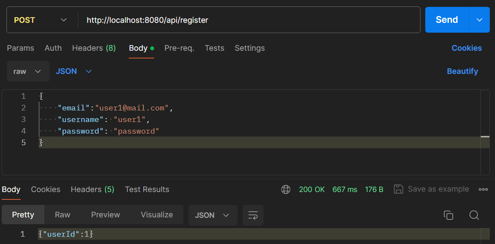
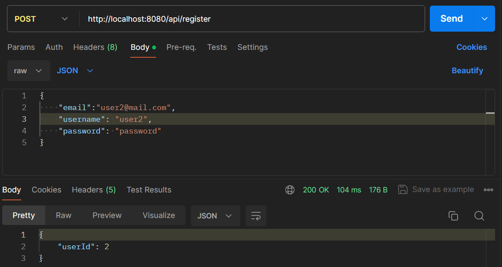

- Make one of the users admin to be able to add books
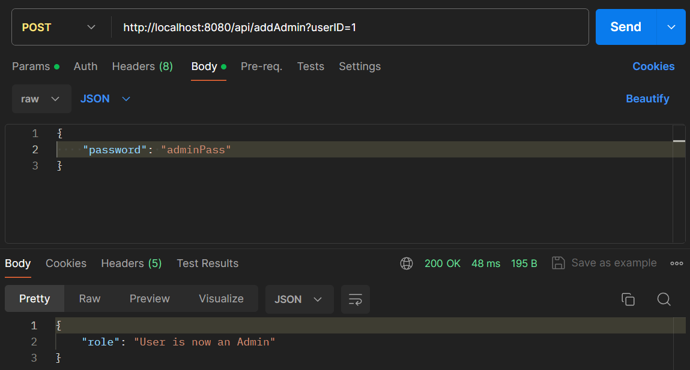
- Create several books using the endpoint for adding a book.
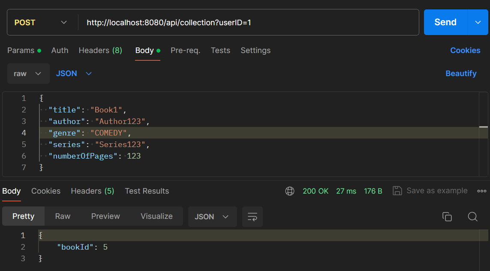
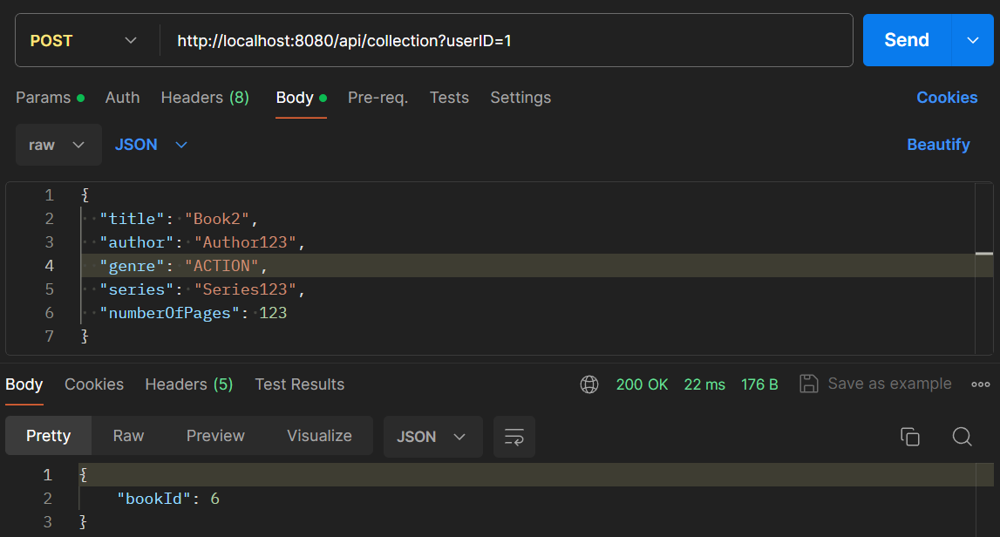
- Set the favorite books and favorite genres of the users using the endpoint for updating a user's details
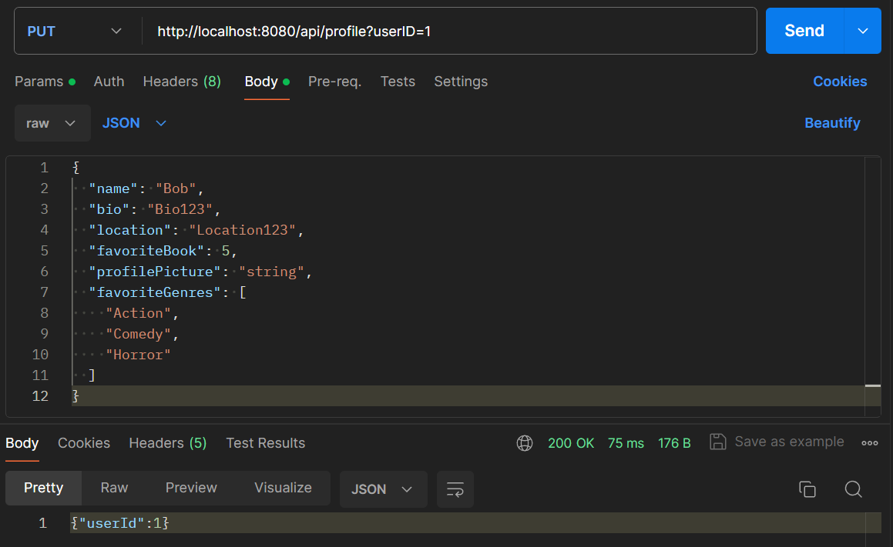
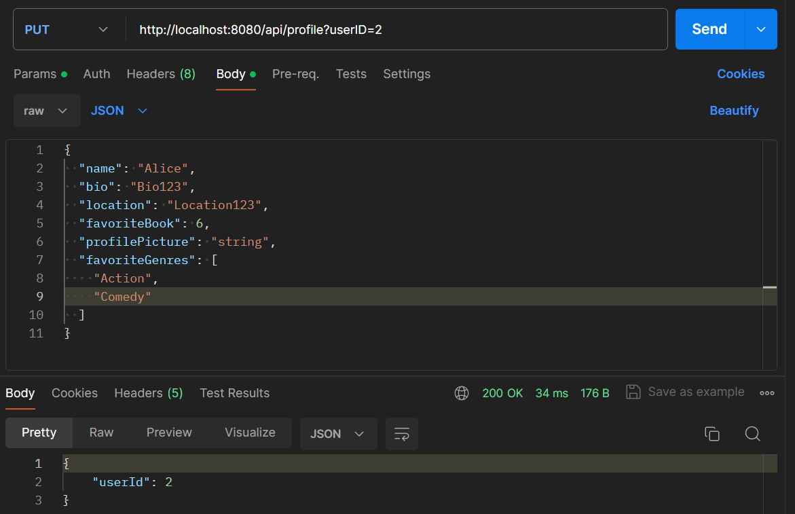
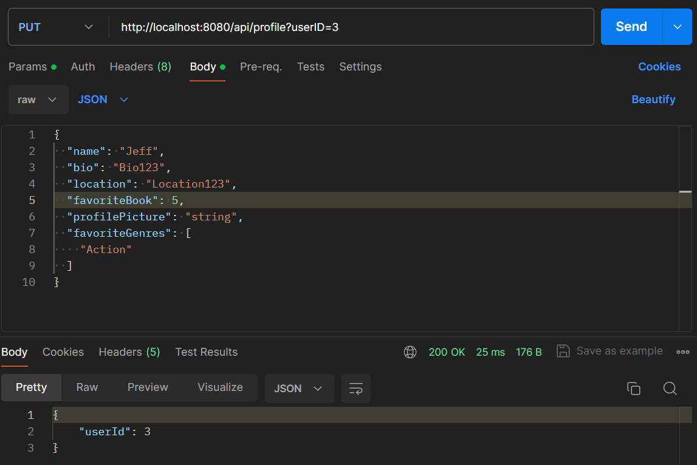
- Enable the privacy setting of all users using the endpoint
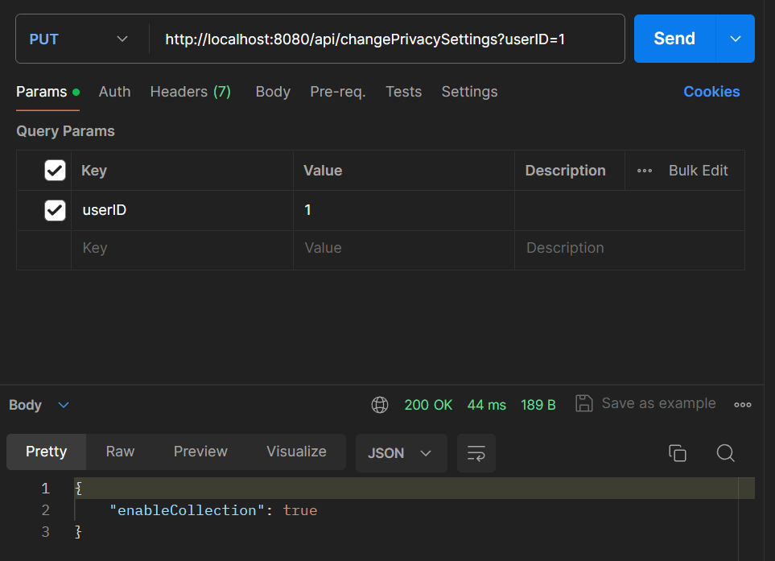
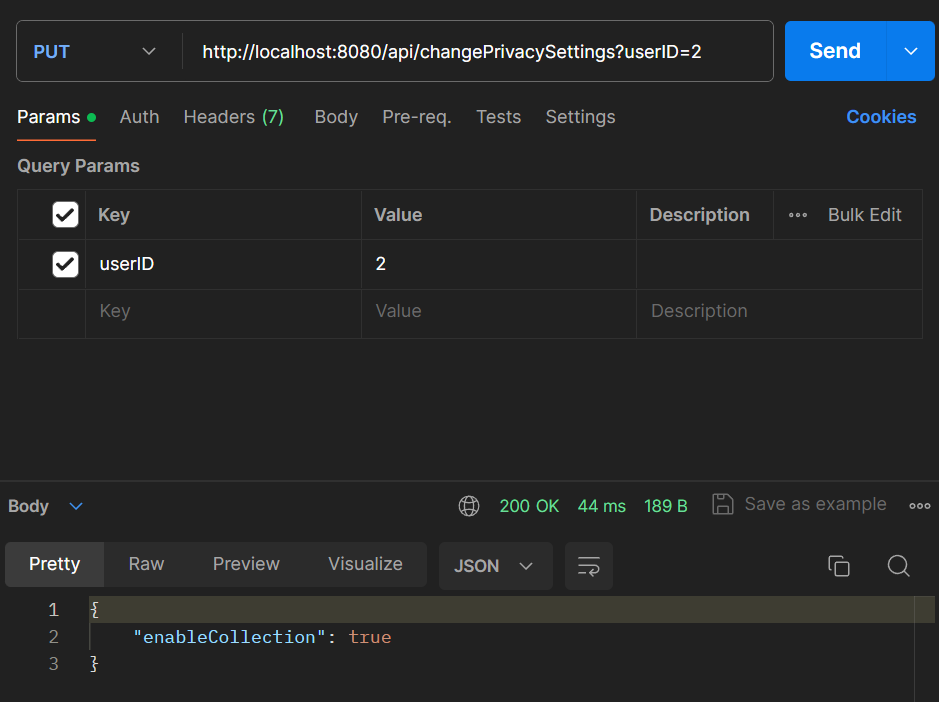
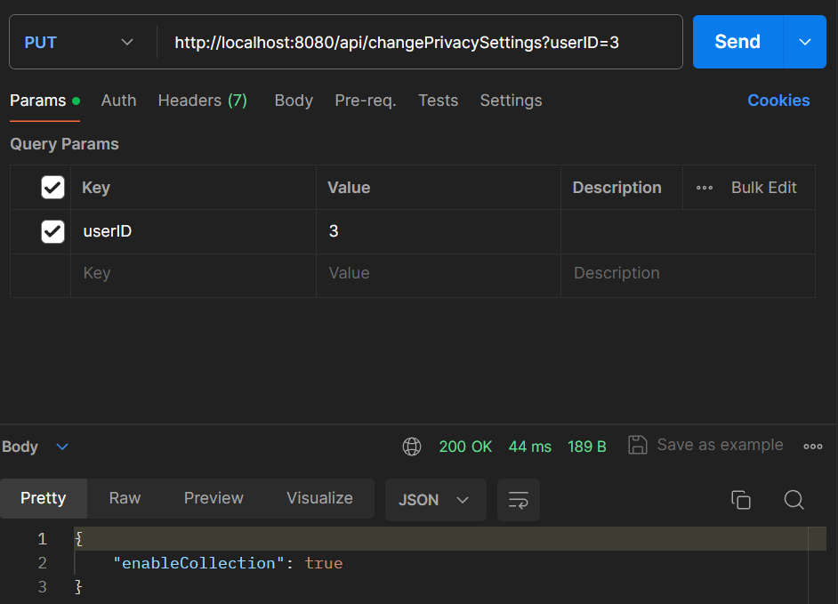
- Login 2 times as user1 and 2 times as user2 using the login endpoint.
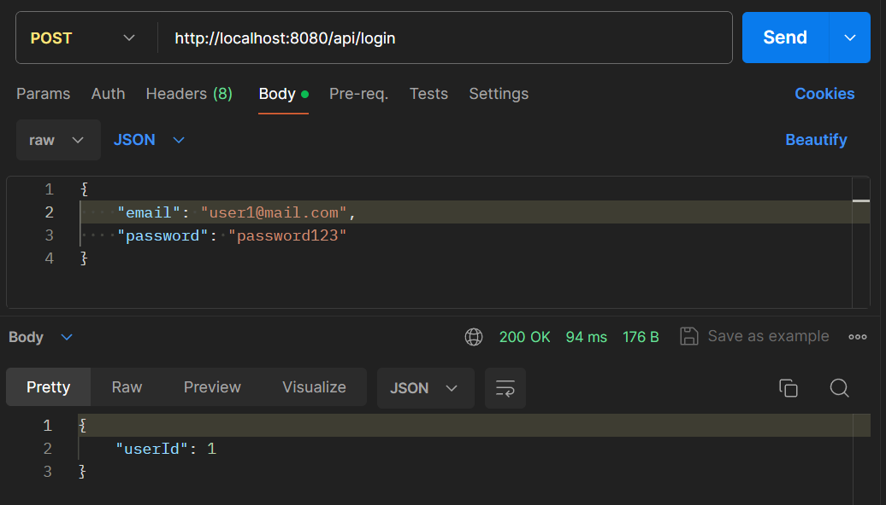
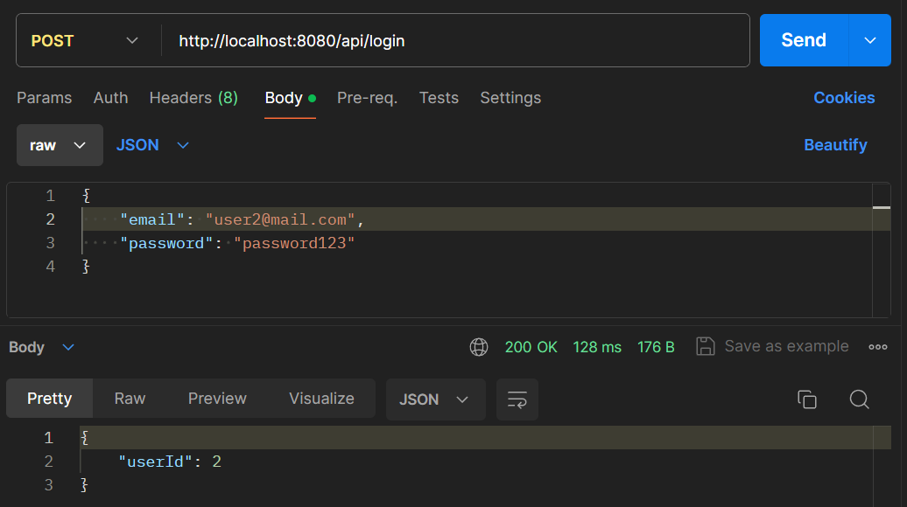
- Fetch book1 4 times using the endpoint for getting a book
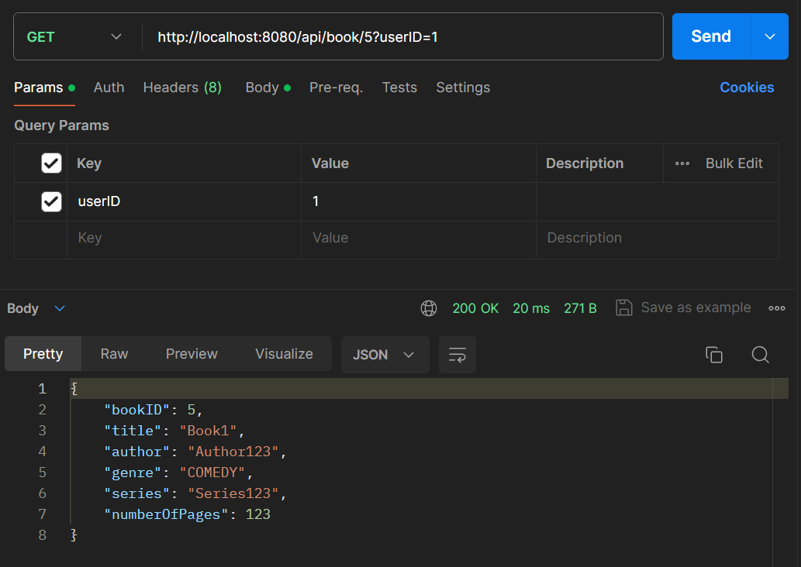
- Show the analytics using the endpoint for getting the analytics
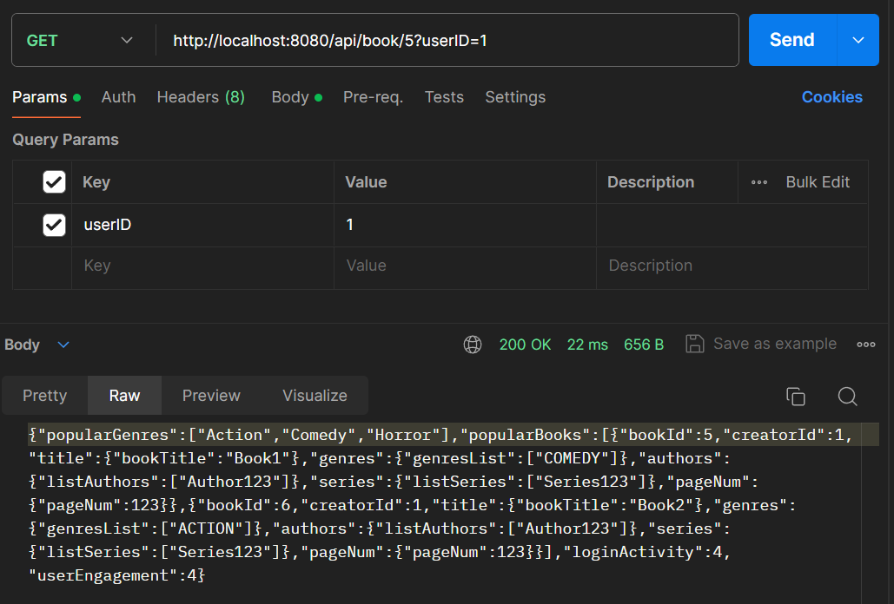
- Change the privacy setting of a user using the endpoint
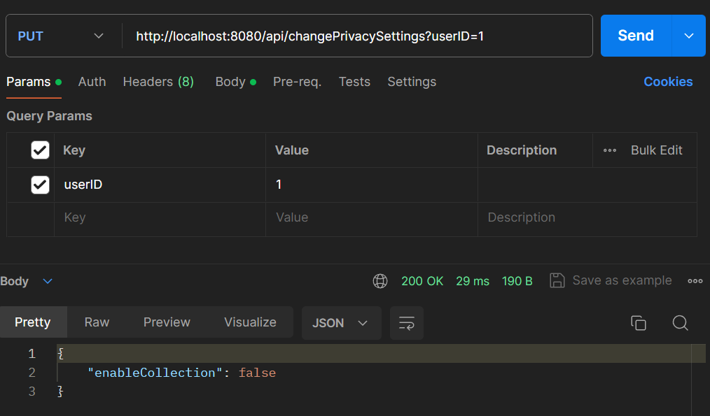
- Show the analytics again using the endpoint for getting the analytics
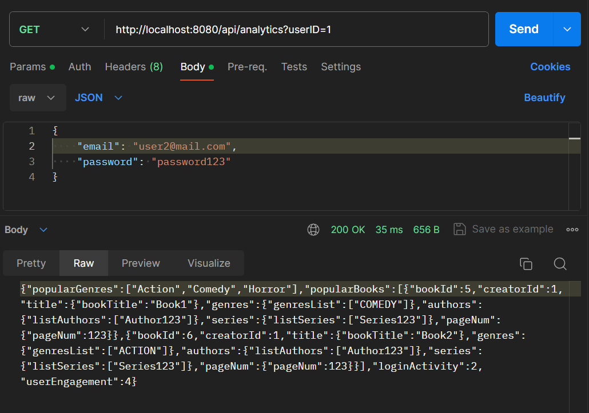
- Verify that the analytics (loginActivity) are different because the user's analytic data is purged

As you can see by the result of calling the analytics endpoint, the analytics have been displayed correctly.