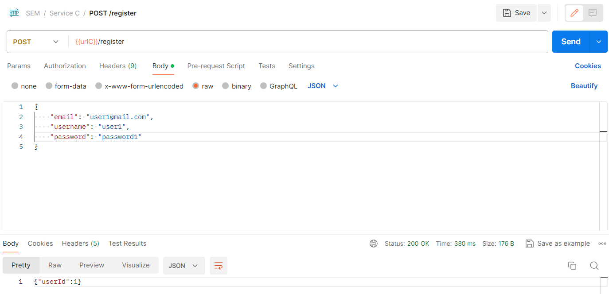
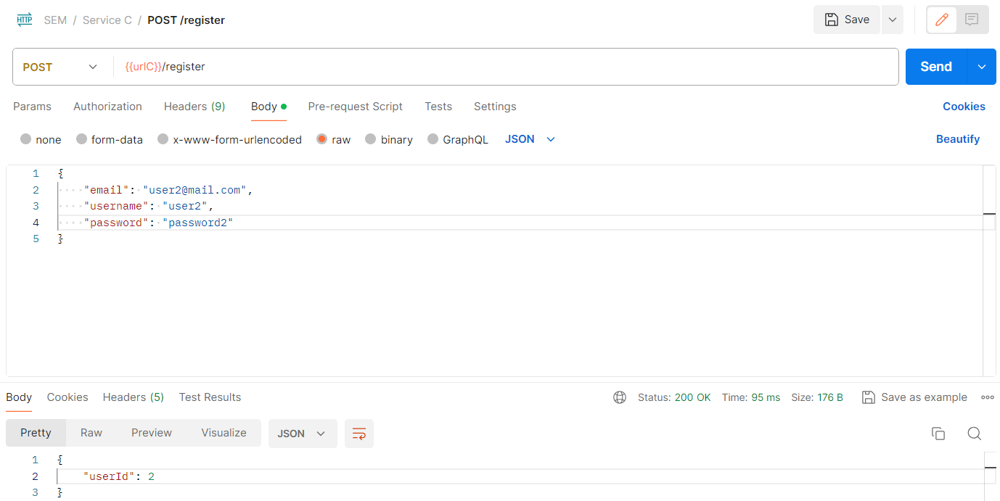
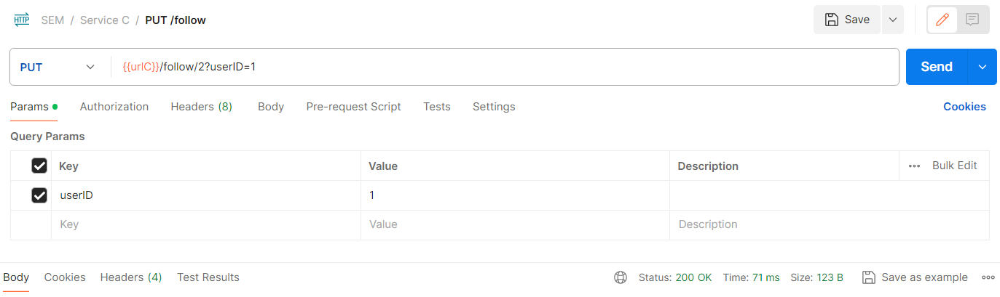
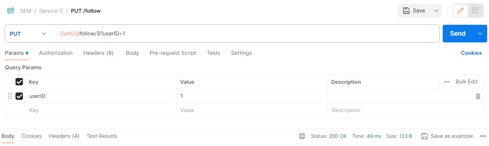
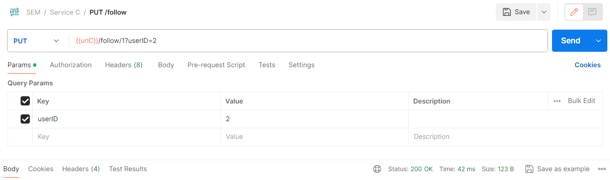
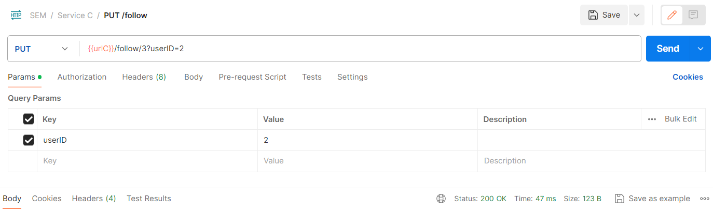
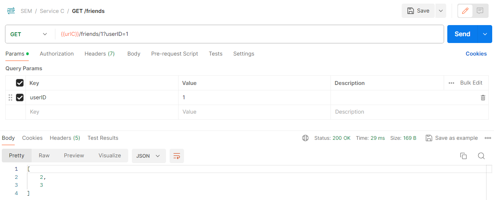
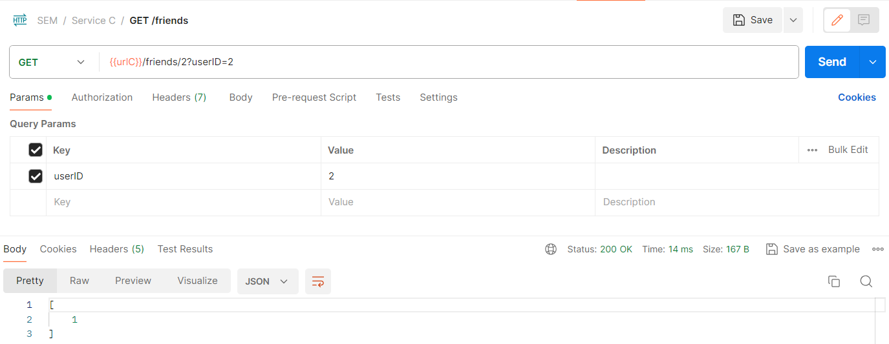
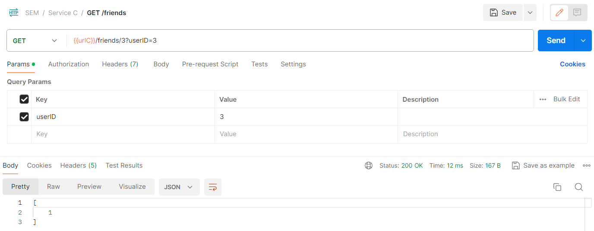

Here we will test the use case corresponding to the functionalities of retrieving the friends of a user 
(namely, the users with whom the provided user has a mutual following).
To test this functionality, we can use the following sequence of requests to our API.

 - Create three users using the registering endpoint.

 - Make the relationships 1->2, 1->3, 2->1, 3->1, 2->3 using the follow endpoint.

 - Retrieve the friends of user 1, 2, and 3, using the get friends endpoint.

As you can see, the friends are retrieved correctly.

 - User 1 has two friends, namely users 2 and 3 since there is a mutual following with both;
 - User 2 has one friend, namely user 1 since there is a mutual following with user 1 
(it follows user 3, but it is not followed back);
 - User 3 has again just one friend, namely user 1 since there is a mutual following with user 1 
(it is followed by user 2, but it does not follow it back).