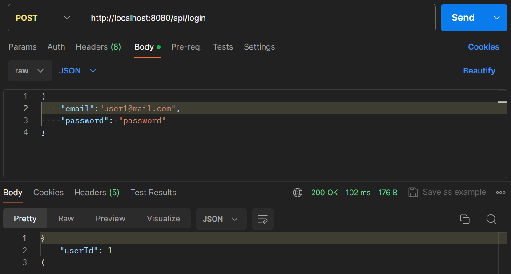

Here we will test the use case corresponding to the functionalities of logging in as a user.
To test this functionality, we can use the following sequence of requests to our API.

 - Create a user using the registering endpoint.

 - Log in as the user using the login endpoint.
 

As you can see by the result of calling the login endpoint with the correct credentials, the user has been logged in successfully.

 - The user has been logged in correctly since the response contains the correct user ID