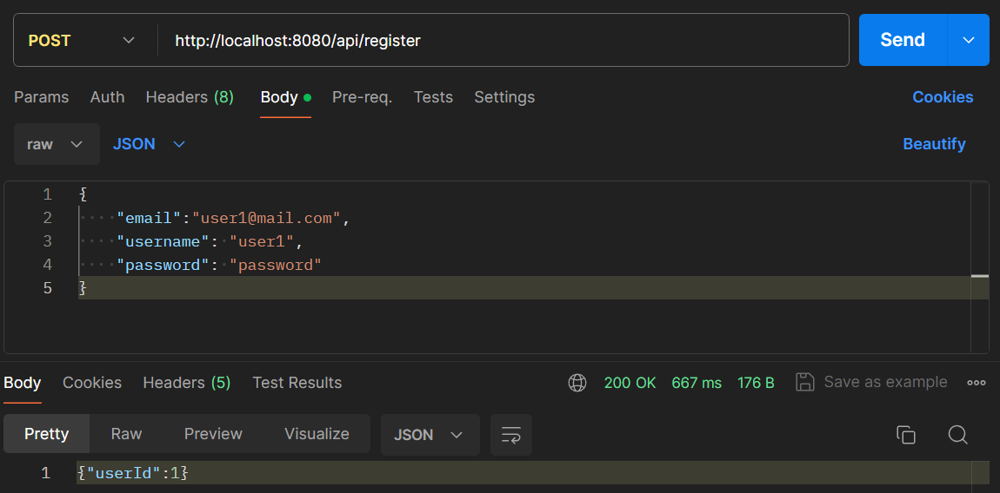
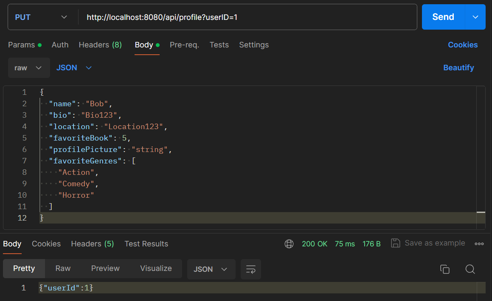
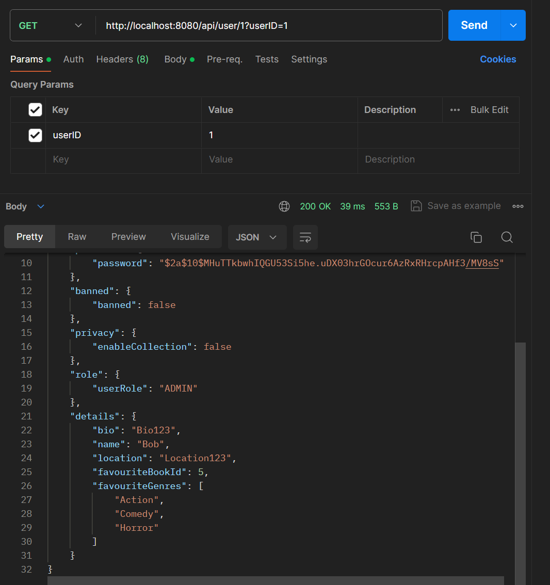

Here we will test the use case corresponding to the functionalities of changing the profile details of a user.
To test this functionality, we can use the following sequence of requests to our API.

 - Create a user using the registering endpoint.

 - Change the user's profile details

 - Verify that the user's profile details have been changed by using the endpoint for getting a user
