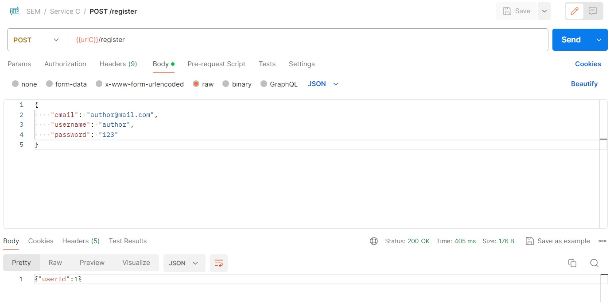
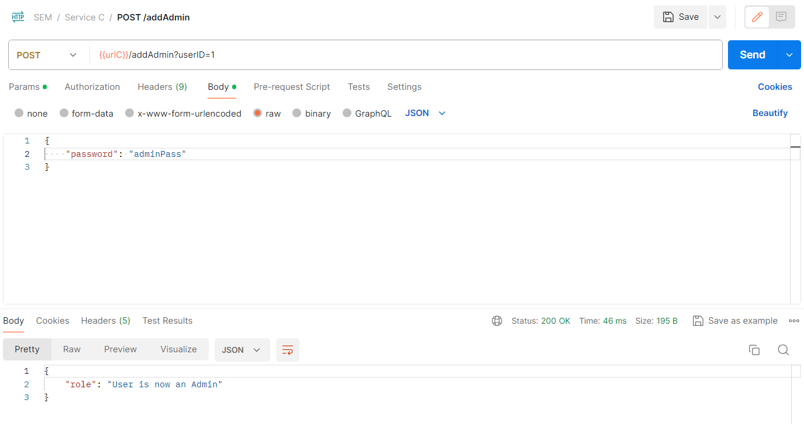
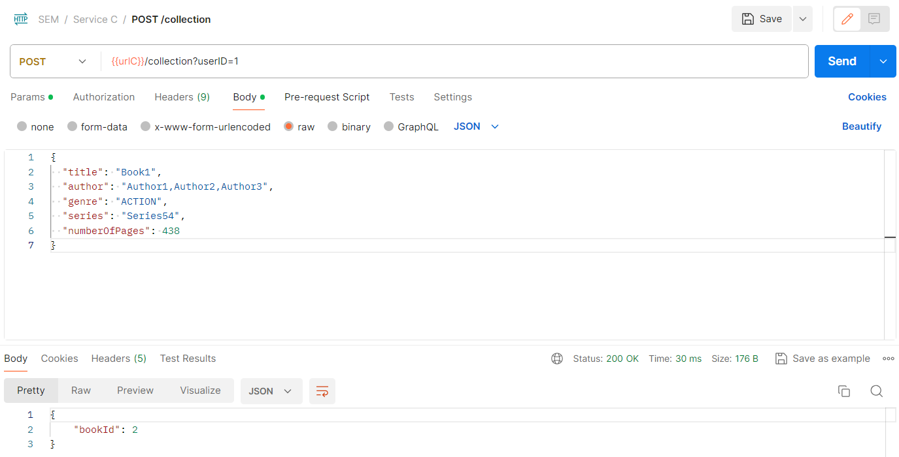
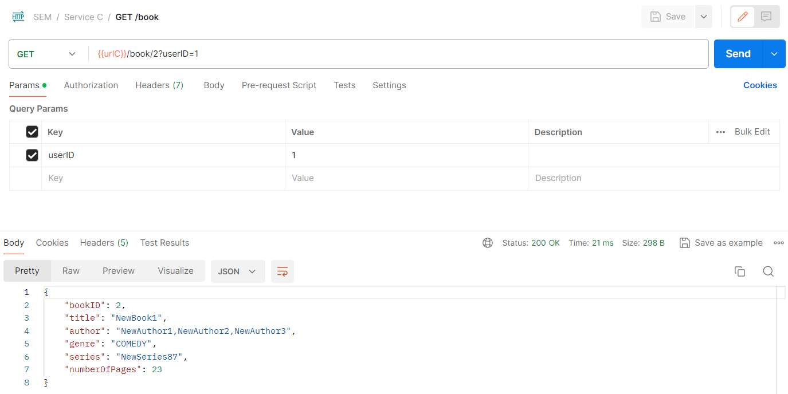
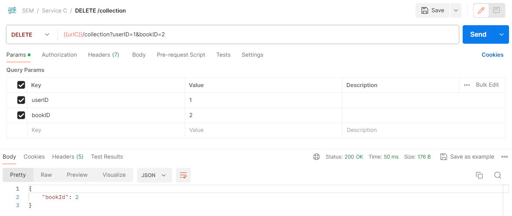
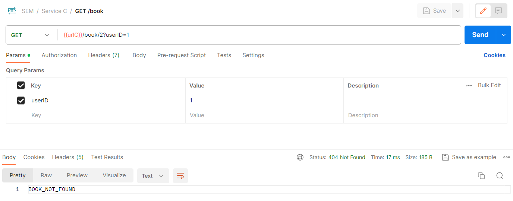

Here we will test the use case corresponding to the functionalities of updating and deleting a book. 
To test this functionality, we can use the following sequence of requests to our API.

 - Create a user using the registering endpoint.

 - Add the user as an admin via the password using the endpoint for adding an admin.

 - Add a book to the collection using the endpoint for adding a book.

 - Update the previously added book using the endpoint for updating a book.

 - Verify that the book has been updated by using the endpoint for getting a book.

 - Delete the previously added book using the endpoint for deleting a book.

 - Verify that the book has been deleted by using the endpoint for getting a book.

As you can see, the book has been updated and deleted successfully.