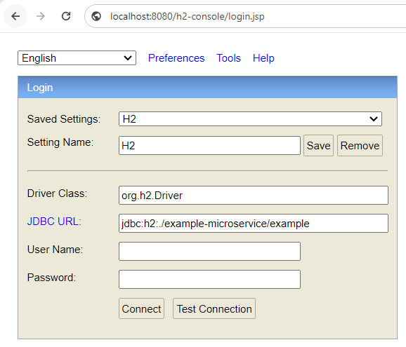
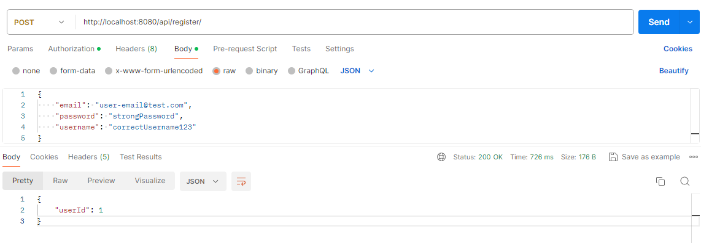
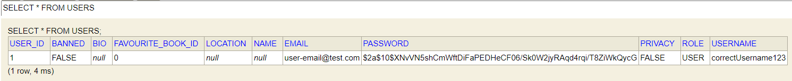
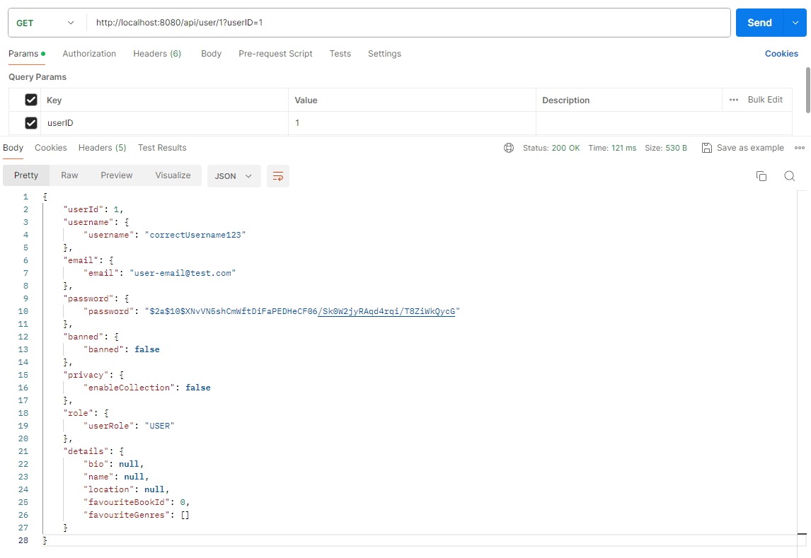
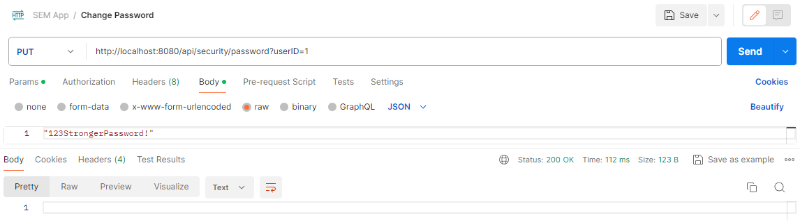
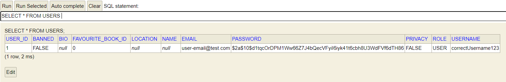

## Manual system tests ##
This document provides details about manual testing endpoints for registering as a user, changing the password and getting a user by their ID.
We will use Postman to send the requests, whilst our H2 database can be reached under:



### User Register ###
We run the following request in Postman to add a user:

```http request
POST http://localhost:8080/api/register/
```
```json
{
    "email": "user-email@test.com",
    "password": "strongPassword",
    "username": "correctUsername123"
}
```



We can  see that the user is saved in our H2 database:



### User Get ###
And now, we can run the following to get that user:
```http request
GET http://localhost:8080/api/user/1?userID=1
```
(request body empty)



### User Change Password ###
We run the following request to change a user's password:
```http request
PUT http://localhost:8080/api/security/password?userID=1
```
```json
"123StrongerPassword!"
```



And after running this request, we can see that the password changed in the H2 DB:



Please note that we store user passwords hashed. Therefore, we can see that the hash has indeed changed, but `GET User` will not return plaintext password, as only hashed password is saved. We use a password library from Spring, hence we can be confident that the password is stored securely and correctly.