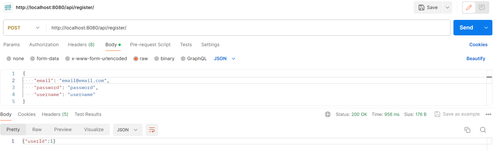

We will test the use cases corresponding to the functionalities of adding and getting a book, and also getting all books in the overall book collection.\
To test this functionality, we can use the following sequence of requests to our API.

- Register a new user via the /register endpoint. 

- Try to add a book as a regular user.

- Since adding books is only allowed for admins or authors, we will have to upgrade our user to admin status via the /addAdmin endpoint.

- Now that our user is an admin, we will attempt to add the book again.

- Now, to make sure that the book was added correctly, and at the same time check the functionality of getting a book from the database, we will call the /book endpoint.

- Let's add a second, so that we have more than one in our database.

- We can now test the functionality of getting all books from the database.

As you can see, the functionalities work as intended:

- We tried to add a book as a regular user but failed. Only admins and authors can add books to the database
- Then we successfully added a book as an admin, which can was verified by retrieving the book from the database
- Finally, we added a second booked and retrieved all books in the database at one