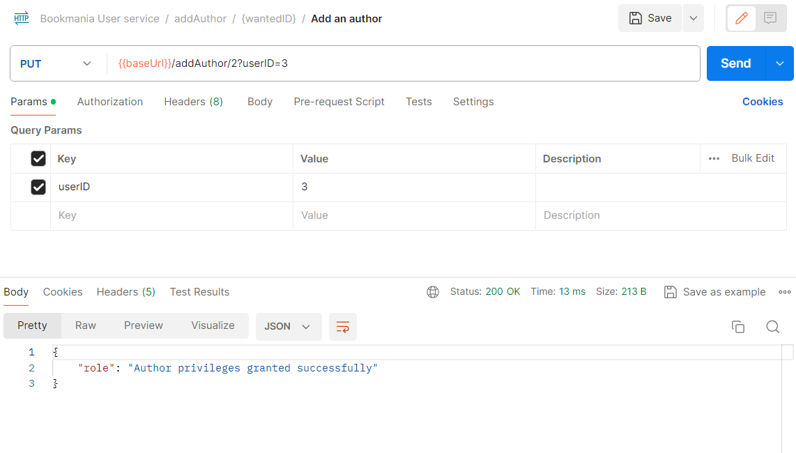
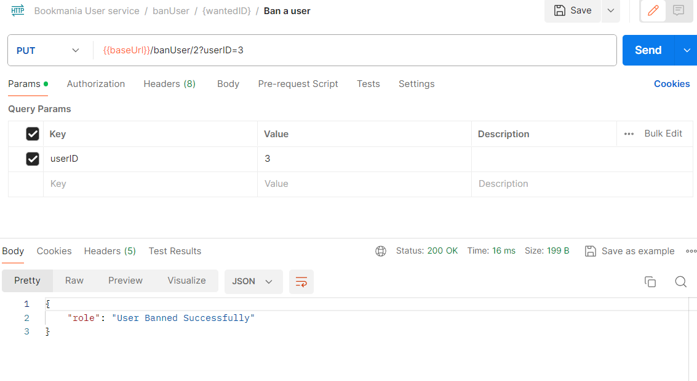
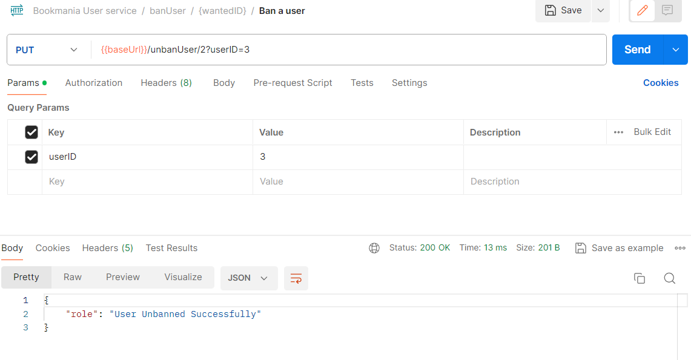
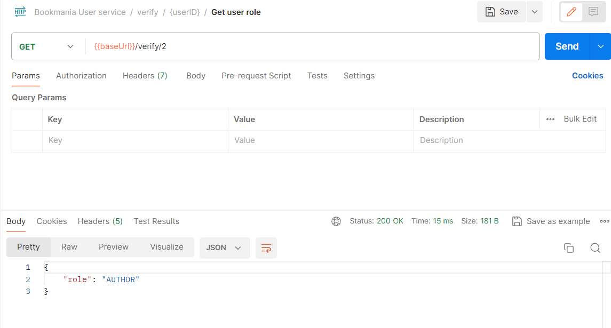
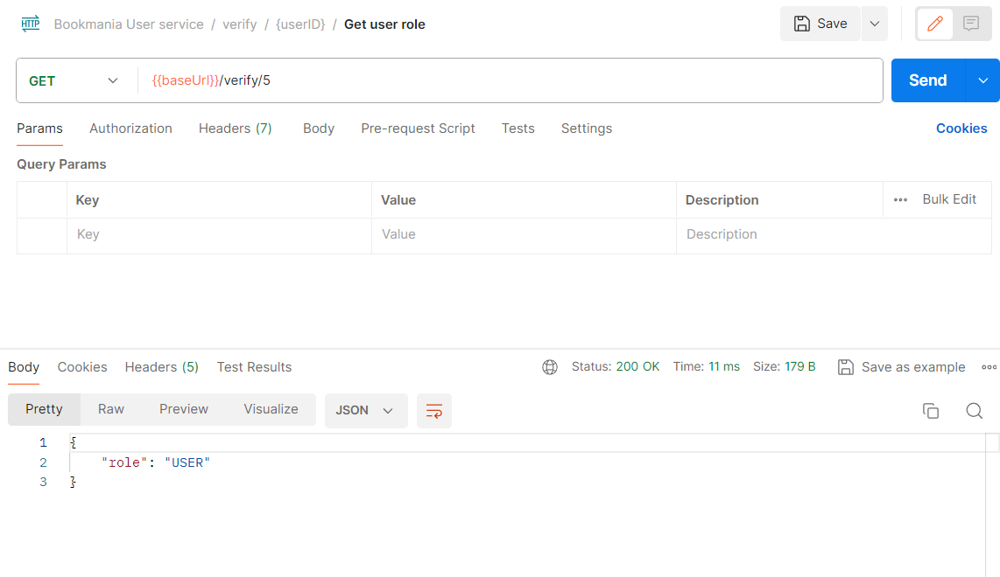
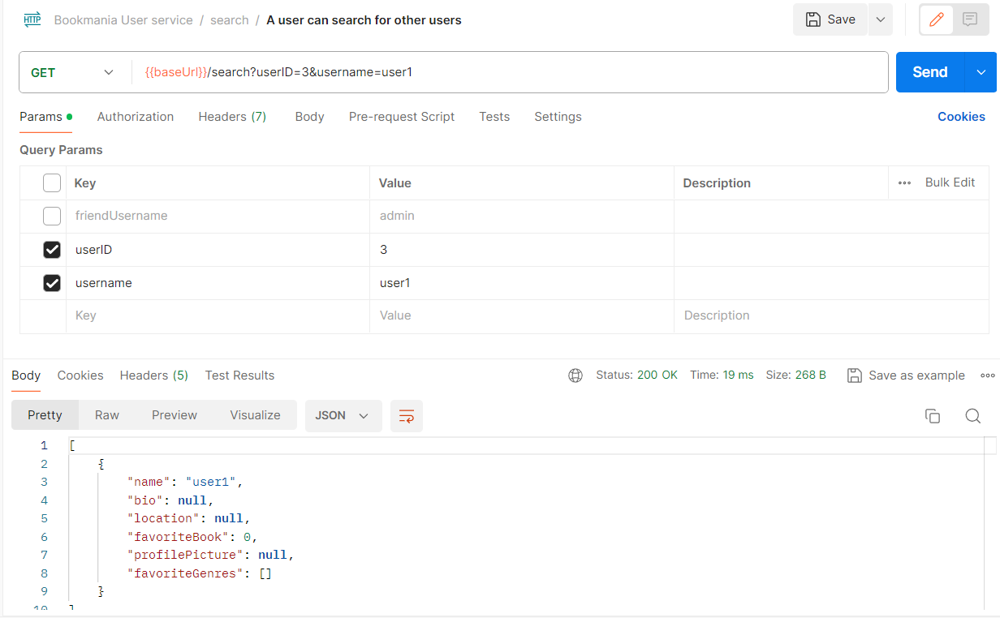
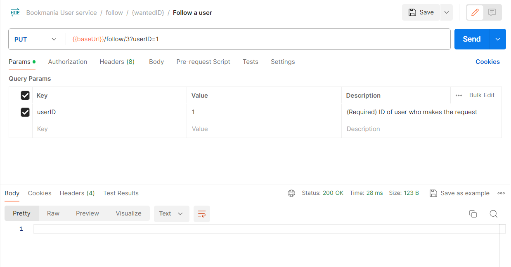
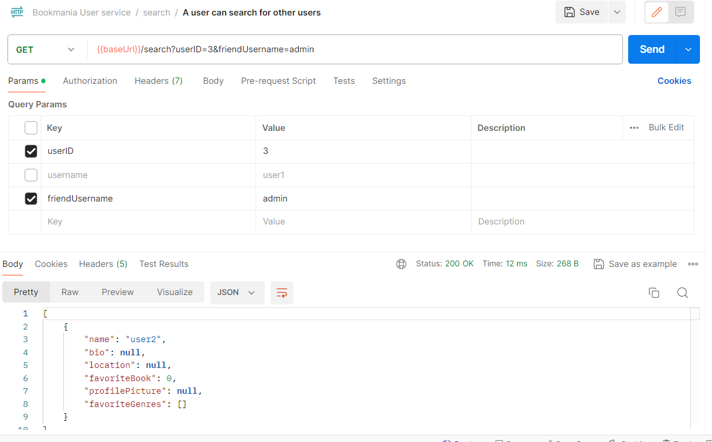
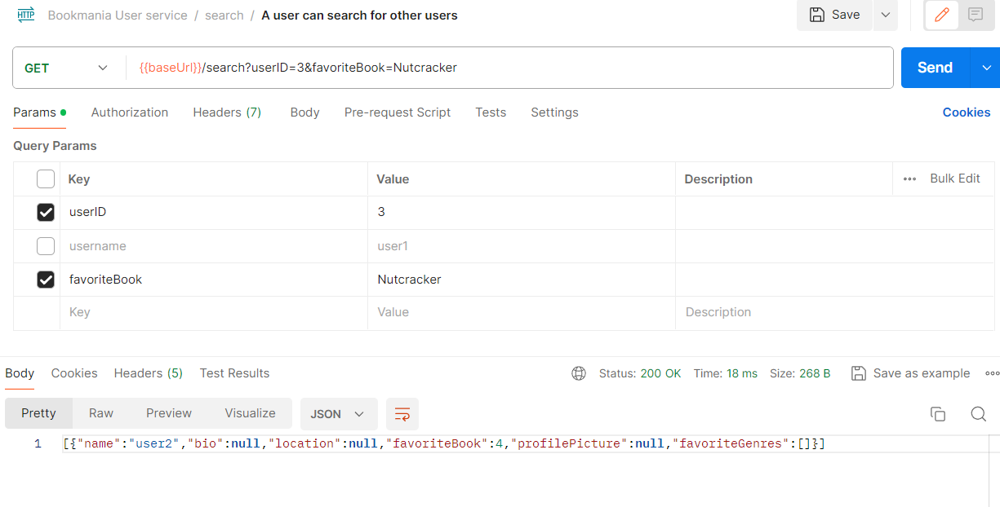

We will test the use cases corresponding to the functionalities of giving admin privileges to a user, then author privileges using the admin, and after that testing the banning, unbanning and search endpoints.
To test all these functionalities, we can use the following sequence of requests to our API.

Now, as presented above, all actions were successful. We used in this case follow to make user 1 and 3 friends so that we were able to also search by friends as illustrated. At the end we also searched for people having the their favorite book 'Nutcracker' by Hoffmann. Most of the actions were performed logged as the user with id=3.