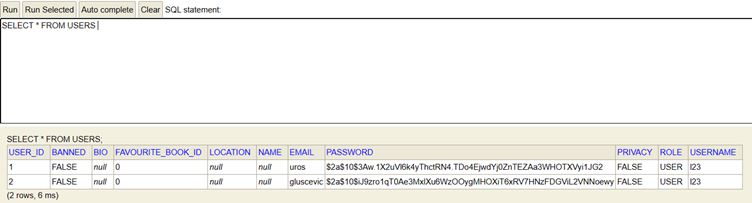
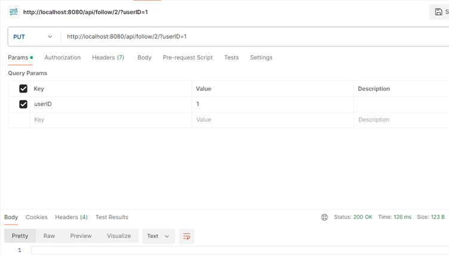
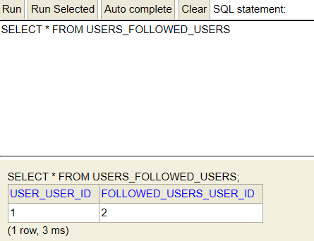
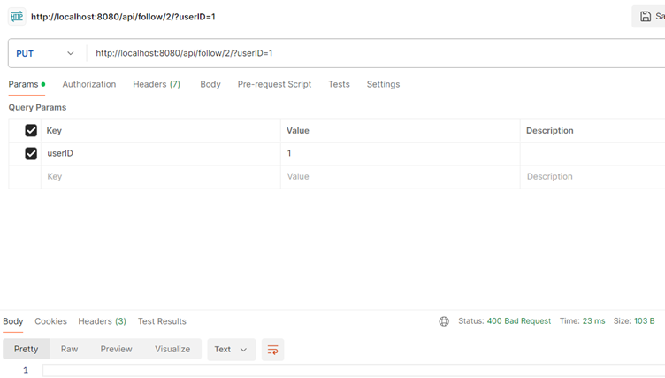
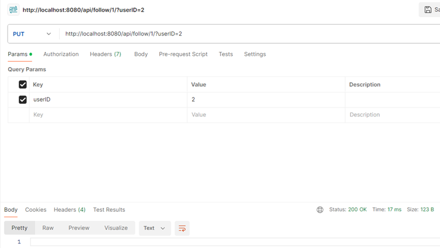
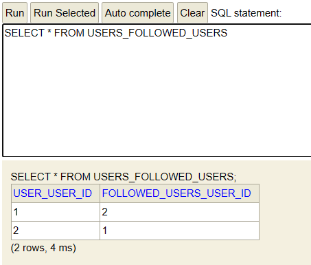
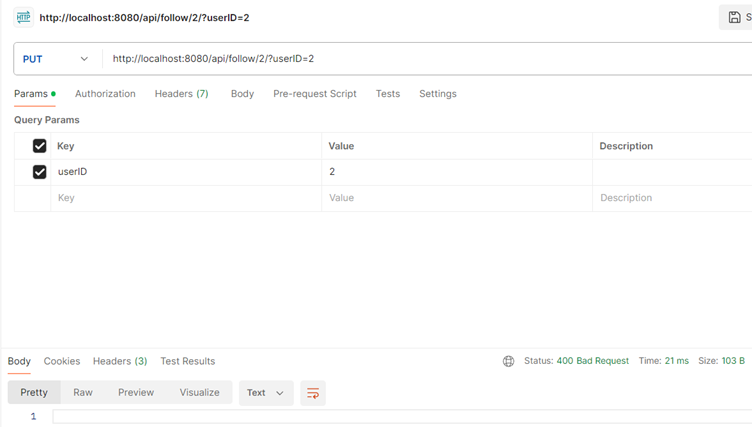
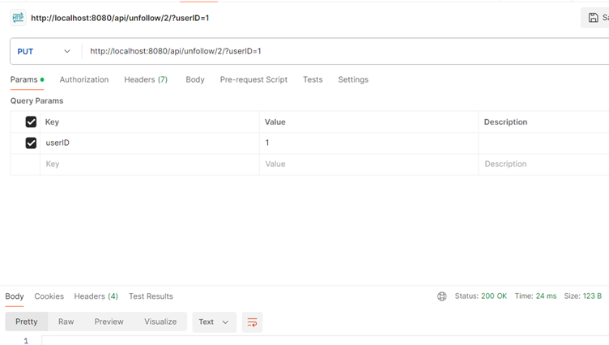
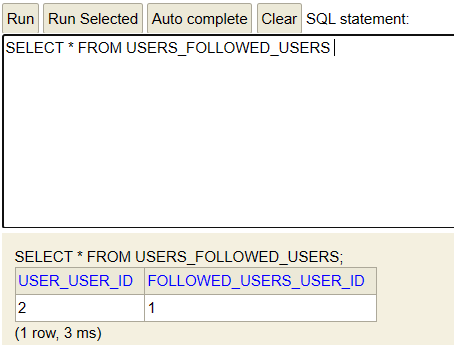
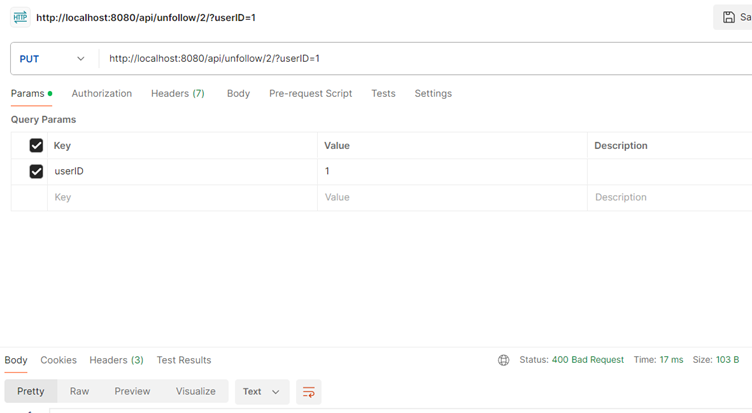

# Overview
In this report I will perform an end-to-end test of the following and unfollowing functionality, which corresponds to the following feature described in our backlog:

#### • Regular users should be able to follow and unfollow other users and authors. Related issues:
- https://gitlab.ewi.tudelft.nl/cse2115/2023-2024/group-23/team-23c/-/issues/19
- https://gitlab.ewi.tudelft.nl/cse2115/2023-2024/group-23/team-23c/-/issues/27

The following use cases will be explored, as well as their effects on the database:
1. User 1 follows user 2
2. User 1 tries to follow user 2 after having already followed them
3. User 2 follows user 1
4. User 2 tries to follow themself
5. User 1 unfollows user 2
6. User 1 tries to unfollow user 2, after having already unfollowed them.

## Section 0 - Setup
To perform the system tests described above, I first need to add two users to the database, so that they can follow each other. I registered two new users, with IDs 1 and 2, respectively. The USERS table in our database can be seen in the figure below:
 

 
## Section 1 - Following a User
The most basic use case would be User 1 trying to follow User 2. To achieve this, we send the following HTTP request to our server:
 

 
Note the parameters of the request - userID=1 means that User 1 is the one doing the following, and they are following user 2, whose ID is specified earlier in the URL.
The server returns status 200 OK, meaning that the request was successful. The figure below confirms this, by showing the new entry created in the USERS_FOLLOWED_USERS table:
 

 
As can be seen above, User 1 now indeed follows User 2.
This concludes this simple use case.

## Section 2 - Following a User Twice
Now that User 1 follows User 2, they can try follow the same user again. If users could follow each other infinitely many times, this would be a problem. Therefore, if the exact same request from above is sent again, the server will this time return a 400 BAD REQUEST code. This behaviour can be seen below:
 

 
## Section 3 - User 2 follows User 1
Another common thing to do would be to follow someone who follows you, which will be shown in this section. In this example, User 2 wants to follow User 1, as seen in the request below. Note that the request is almost identical to those shown above, just with the UserIDs flipped:
 

 
Of course, this adds another row to the USER_FOLLOWING_USER table:
 

 
## Section 4 - Trying to Follow Yourself
An interesting thing users might try to do would be following their own profile. This does not make any sense, so we decided to prevent it. The request above shows user 2 trying to follow themself, but the server returns a 400 BAD REQUEST, and nothing is changed in the database:
 

 
## Section 5 - Unfollowing a User
Whenever users can follow one another, it is reasonable to expect that they might want to unfollow someone as well. In this scenario, User 1 sends a request to the Unfollow endpoint, in order to stop following User 2:
 

 
The server returns a 200 OK response, and an entry is removed from the USER_FOLLOWING_USER table:
 

 
## Section 6 - Unfollowing Someone who is not Followed
Of course, after unfollowing User 2, User 1 might mistakenly try to unfollow them again. They should not be able to do this, so our server returns a 400 BAD REQUEST:
 

 
## Conclusion
To summarise, this section has shown how users would usually make use of the follow and unfollow features. We have shown what those requests look like, as well as how users know whether their requests were successful, and how that affects our database.
Finally, we have shown how users could make invalid requests, and what response codes our server returns then.

